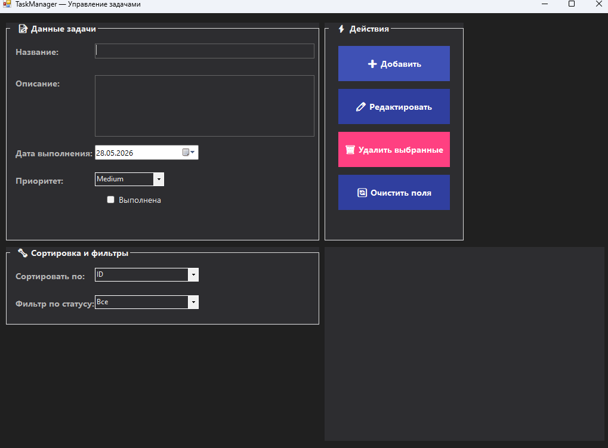

# TaskManagerWinForms

✅ **Десктопное приложение для управления задачами на C# и Windows Forms**



## 📖 О проекте

**TaskManagerWinForms** — это простое и удобное приложение для ведения списка задач. 
Позволяет добавлять, удалять, отмечать выполненные задачи.

## 🎯 Функционал

- Добавление, редактирование, удаление задач
- Отметка о выполнении
- Удаление задач
- Сортировка по ID, дате, приоритету, названию
- Фильтрация по статусу (Все / Не выполнены / Выполнены)
- Просроченные задачи выделяются красным цветом

## 🛠️ Стек технологий

- C# / .NET 8
- Windows Forms

## 🚀 Как запустить

1. Установите [.NET 8 SDK](https://dotnet.microsoft.com/download)
2. Клонируйте репозиторий:
   ```bash
   git clone https://github.com/Fanatweb/TaskManagerWinForms.git
